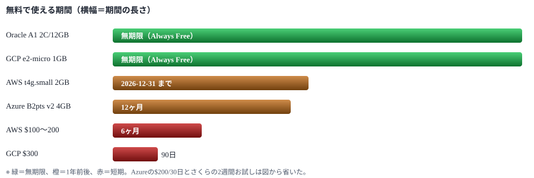
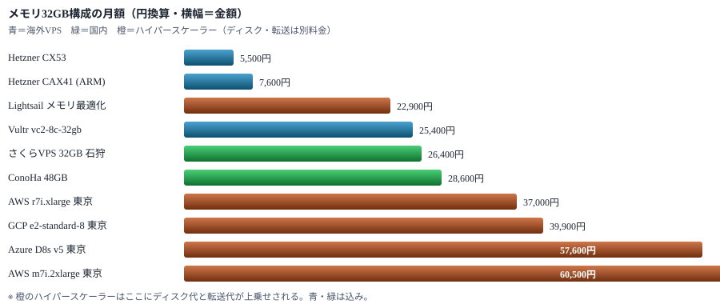
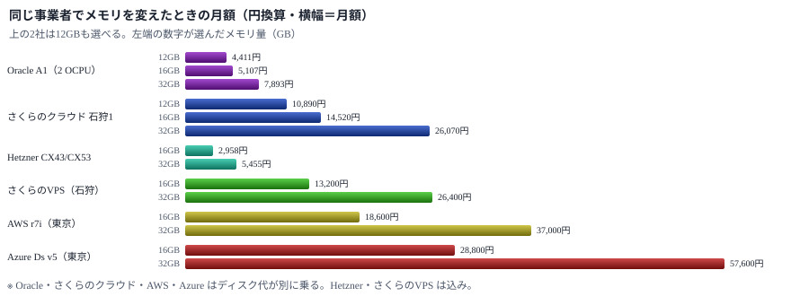
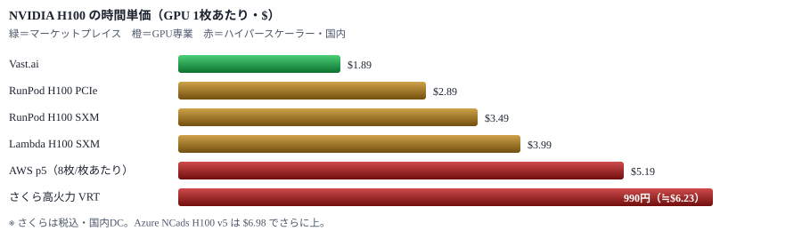

# クラウド環境の比較調査 — 無料枠・メモリ・GPU

GCP / AWS / Azure / Oracle Cloud / さくら / 国内VPS / 海外格安VPS / GPU専業クラウドを対象に、無料枠の条件・メモリ12GB / 16GB / 32GB 構成の価格・GPU付きインスタンスの価格を横並びにした。

> 📅 作成: 2026-09-12 / 更新: 2026-09-17

[親サイトへ戻る](../)

## 目次

1. [無料枠で使えるもの](#1-無料枠で使えるもの)
2. [メモリ12GB・16GB・32GB構成の価格比較](#2-メモリ12gb16gb32gb構成の価格比較)
3. [GPU付きインスタンスの価格比較](#3-gpu付きインスタンスの価格比較)
4. [用途別の選び方と注意点](#4-用途別の選び方と注意点)

## 1. 無料枠で使えるもの

2026年時点で「無期限で無料のVM」を出しているのは **Oracle Cloud** と **Google Cloud** の2社だけである。AWS と Azure は期間限定のクレジット方式に寄っている。

> [!NOTE]
> <strong>AWSの無料枠は2025年7月15日に作り替えられた。</strong>新規アカウントでは「EC2 750時間/月を12ヶ月」という従来の枠は**もう使えない**。$100のクレジット（オンボーディング5課題の達成で最大$200）を**6ヶ月**で使い切る方式に変わっている。12ヶ月無料が残っているのは2025年7月15日より前に作ったアカウントだけ。

### 無料枠の一覧

| 事業者 | 種類 | 期間 | スペック・条件 |
|---|---|---|---|
| Oracle Cloud | ✅ **無期限** Always Free | 無期限 | Ampere A1（ARM）**2 OCPU / メモリ12GB**（1,500 OCPU時間 + 9,000 GB時間/月）。加えて AMD の `VM.Standard.E2.1.Micro`（1/8 OCPU・1GB）を2台。ブロックストレージ合計200GB、下り10TB/月。ホームリージョンのみ。 |
| Google Cloud | ✅ **無期限** Always Free | 無期限 | `e2-micro` 1台（0.25〜2 vCPUバースト / メモリ1GB）。**us-west1・us-central1・us-east1 のみ**。標準永続ディスク30GB、北米からの下り1GB/月。 |
| Google Cloud | ⚠ **期間限定** 無料トライアル | 90日 | $300クレジット。過去にGoogle Cloud / Maps Platform / Firebase の有料ユーザーだったことがないアカウントのみ。 |
| AWS | ⚠ **期間限定** Free Plan（新方式） | 6ヶ月 | $100クレジット。EC2の起動と終了・RDS構成・Lambdaデプロイ・Bedrockのプロンプト試行・Budgets設定の5課題で追加$100。クレジットを使い切るか6ヶ月が過ぎるとアカウントが閉じる（Free Planでは超過課金は発生しない）。30以上の「常に無料」サービスは別途あり。 |
| AWS | ✅ **実質VM** T4g無料トライアル | 2026-12-31まで | `t4g.small`（ARM 2vCPU / 2GB）を**750時間/月**。全リージョン合算。新規・既存を問わず全アカウントが対象。超過分のCPUクレジットは課金される。繰り越し不可。 |
| Azure | ⚠ **期間限定** 無料アカウント | 30日 + 12ヶ月 | 最初の30日は$200クレジット（未使用分は消滅）。以降12ヶ月は `B1S`・`B2pts v2`（ARM）・`B2ats v2`（AMD）を合計**750時間/月**。リージョンの制限はなく、750時間の範囲なら複数台に割ってもよい。 |
| さくらのVPS | ⚠ **お試し** 無料お試し | 2週間 | 全プランが対象。同時2台まで、お試し中は下り帯域10Mbpsに制限。クレジットカード登録が必要。 |
| その他の国内VPS | **なし** | — | ConoHa VPS・Xserver VPS に常設の無料枠はない。キャンペーンによる割引のみ。 |

### 無料で使える期間の比較



> [!NOTE]
> <strong>Oracle Cloud の無料枠は2026年6月15日に半減した。</strong>Ampere A1 が 4 OCPU / 24GB → **2 OCPU / 12GB** に変わっている。告知はなくドキュメントが書き換わっただけで、既存の 4 OCPU 構成を動かし続けていた利用者は停止や課金に直面した。「無料で24GB」という2025年以前の情報を見て設計すると外れる。

### 無料枠でメモリ32GB・16GBは賄えるか

<strong>どちらも賄えない。</strong>無期限の無料枠で最大なのは Oracle Cloud の 12GB で、32GBにも16GBにも届かない。AWS・Azure のクレジットは金額で消えるため、32GBのインスタンスを常時起動すると数週間から1ヶ月程度で尽きる。16GBなら持ちは倍になるが、期限そのものは延びない。

| クレジット | 金額 | 32GB機を常時起動した場合の目安 |
|---|---:|---|
| AWS Free Plan | $100〜200 | 東京の `m7i.2xlarge`（$0.521/時）なら**約8〜16日**で尽きる |
| GCP 無料トライアル | $300 | 東京の `e2-standard-8`（$0.344/時）なら**約36日**（90日の期限より先にクレジットが尽きる） |
| Azure 無料アカウント | $200 | 東京の `D8s v5`（$0.496/時）なら**約17日**（30日の期限より先に尽きる） |

無料枠の使いどころは、32GB機の本番運用ではなく「検証用の踏み台」「監視・cron の常駐先」「短期のPoC」に限られる。

## 2. メモリ12GB・16GB・32GB構成の価格比較

ここが本題である。<strong>結論から言うと、同じ32GBでも月あたり5,500円から60,000円まで10倍以上の開きがある。</strong>この差は性能差というより課金モデルの差で、ハイパースケーラー（AWS/GCP/Azure）は時間課金・ディスク別・転送量別、VPS系は定額・ディスク込み・転送込みという違いが効いている。

小さい順に12GB・16GB・32GBを並べる。**価格はメモリ量にほぼ比例する**ため、まとめ買いの割引は期待できない。必要量を実測して小さいほうを選ぶのが最も効く。無料枠も同じ軸に置いて比べる。

> [!NOTE]
> **為替は $1 = 159円 / €1 = 185円 で換算した**（2026年9月初旬の水準）。ドル建て・ユーロ建てのサービスは為替で±10%程度は簡単に動くので、円換算は目安として読むこと。ハイパースケーラーの月額は **730時間/月**で計算している。

### 無料で届くのは12GBまで

無料枠も同じ軸に並べると境目がはっきりする。<strong>無期限で無料のまま使える最大のメモリは Oracle Cloud の12GB。</strong>それを超えると、どの事業者でも必ず課金が始まる。

| メモリ | 最安の手段 | 月額 | 条件 |
|---|---|---:|---|
| 1GB | GCP `e2-micro` | 0円 | ✅ **無期限** 米国3リージョンのみ、ディスク30GB |
| 2GB | AWS `t4g.small` | 0円 | ⚠ **2026年末まで** 750時間/月、全リージョン合算 |
| 4GB | Azure `B2pts v2` | 0円 | ⚠ **12ヶ月** 750時間/月、リージョン制限なし |
| 12GB | Oracle Ampere A1（2 OCPU） | 0円 | ✅ **無期限** ホームリージョンのみ、ストレージ200GB、下り10TB/月 |
| 16GB | Hetzner `CX43` | 約2,958円 | ここから課金。国内なら さくらのVPS 16GB 石狩で13,200円 |
| 32GB | Hetzner `CX53` | 約5,455円 | 国内なら さくらのVPS 32GB 石狩で26,400円 |

> [!NOTE]
> <strong>12GBと16GBの間に段差がある。</strong>12GBまでは0円で、16GBになると国内では月13,200円かかる。メモリ使用量が12GB前後で収まるなら、Oracle の無料枠に載せられるかを先に確かめたほうがよい。逆に16GBを超えることが確定しているなら、無料枠の検討に時間をかける意味はない。

### メモリ12GB ─ 選べる事業者が少ない

12GBを標準プランとして持つ事業者は限られる。<strong>AWS・Azure・Hetzner・さくらのVPS・Xserver VPS・Lightsail はいずれも 8GB → 16GB の刻みで、12GB を選べない。</strong>12GBちょうどを買えるのは次の5つである。

| 事業者・プラン | vCPU | メモリ | ストレージ | 月額（原価） | 円/月 | 備考 |
|---|---:|---:|---:|---:|---:|---|
| Oracle Ampere A1（2 OCPU） | 2 OCPU | 12GB | 別料金 | $27.74 | 4,411 | ✅ **無料枠内なら0円** 1GB刻みで柔軟に組める。ARM |
| ConoHa VPS 12GB | 6 | 12GB | 100GB | 7,348円 | 7,348 | ✅ **国内** 時間単価14.6円。長期割引あり |
| さくらのクラウド 3コア12GB | 3 | 12GB | 別料金 | 10,890円〜 | 10,890〜 | ✅ **国内** 石狩第1が10,890円、東京第1は13,200円。転送量課金なし |
| Vultr `vhp-4c-12gb` | 4 | 12GB | 260GB | $72 | 11,448 | High Performance。AMD版とIntel版が同額 |
| さくらのクラウド 8コア12GB | 8 | 12GB | 別料金 | 15,840円〜 | 15,840〜 | ✅ **国内** 石狩第1。コア数は3〜20から選べる |

GCP はカスタムマシンタイプで12GB構成を作れるが、定義済みタイプの単価に5%のプレミアムが乗る。

> [!NOTE]
> <strong>Oracle Ampere A1 の無料枠はちょうど 2 OCPU / 12GB。</strong>つまりこの構成1台なら0円で、上の $27.74 は無料枠を使い切ったあと（2台目以降など）の価格である。従量単価は **OCPU $0.01/時 ＋ メモリ $0.0015/GB時**で、有料になっても12GBとして最安で、ConoHa の 7,348円より安い。ただしブロックストレージは別課金（無料枠は200GBまで）。

### メモリ16GB ─ ハイパースケーラー（東京リージョン・オンデマンド）

16GBではメモリ最適化型（vCPU 2個）が効く。**CPUを使わない用途なら、4vCPUの汎用型を買う理由がない。**

| 事業者 | インスタンス | vCPU | メモリ | $/時 | $/月 | 円/月 | 備考 |
|---|---|---:|---:|---:|---:|---:|---|
| GCP | `e2-highmem-2` | 2 | 16GB | 0.116 | 85 | 13,500 | メモリ最適化。3社の16GBで最安 |
| Azure | `E2s v5` | 2 | 16GB | 0.152 | 111 | 17,600 | メモリ最適化 |
| AWS | `r7i.large` | 2 | 16GB | 0.160 | 117 | 18,600 | メモリ最適化 |
| GCP | `e2-standard-4` | 4 | 16GB | 0.172 | 126 | 20,000 | 4vCPU付きでこの価格。CPUも使うなら有利 |
| AWS | `m7g.xlarge` | 4 | 16GB | 0.211 | 154 | 24,500 | Graviton（ARM）。x86版より19%安い |
| Azure | `D4s v5` | 4 | 16GB | 0.248 | 181 | 28,800 | 1年予約で $0.153/時（約38%引き） |
| AWS | `m7i.xlarge` | 4 | 16GB | 0.260 | 190 | 30,200 | Intel汎用 |

米国リージョンの単価は GCP `e2-highmem-2` $0.090 ／ Azure `E2s v5` $0.126 ／ AWS `r7i.large` $0.132 ／ GCP `e2-standard-4` $0.134 ／ AWS `m7g.xlarge` $0.163 ／ Azure `D4s v5` $0.192 ／ AWS `m7i.xlarge` $0.202 で、東京との差は32GBと同じく2〜3割である。

### メモリ16GB ─ VPS・定額系（ディスク・転送込み）

| 事業者・プラン | vCPU | メモリ | ストレージ | 月額（原価） | 円/月 | 備考 |
|---|---:|---:|---:|---:|---:|---|
| Hetzner `CX43` | 8 | 16GB | 160GB | €15.99 | 2,958 | ⚠ **要確認** 共有vCPU。転送20TB込み。新規提供の停止情報あり |
| Hetzner `CAX31` | 8 | 16GB | 160GB | €20.99 | 3,883 | ⚠ **要確認** ARM（Ampere）。同上 |
| Oracle Ampere A1（2 OCPU） | 2 OCPU | 16GB | 別料金 | $32.12 | 5,107 | 無料枠（12GB）を4GB超える分だけ課金。ディスクは別 |
| AWS Lightsail メモリ最適化 | 2 | 16GB | 160GB | $74 | 11,766 | 転送5TB込み |
| Vultr `vc2-6c-16gb` | 6 | 16GB | 320GB | $80 | 12,720 | Regular Performance |
| Vultr `voc-m-2c-16gb-100s` | 2 | 16GB | 100GB | $80 | 12,720 | Optimized（メモリ最適化）。専有CPU |
| さくらのVPS 16GB（石狩） | 8 | 16GB | 800GB | 13,200円 | 13,200 | ✅ **国内** 年額一括なら実質12,100円/月。SLAあり |
| AWS Lightsail 汎用 | 4 | 16GB | 320GB | $84 | 13,356 | 転送6TB込み |
| さくらのクラウド 4コア16GB | 4 | 16GB | 別料金 | 14,520円〜 | 14,520〜 | ✅ **国内** ゾーンにより14,520〜18,150円。転送量課金なし |
| Vultr `vhf-4c-16gb` | 4 | 16GB | 384GB | $96 | 15,264 | High Frequency。高クロック＋NVMe |
| さくらのVPS 16GB（東京） | 8 | 16GB | 800GB | 15,400円 | 15,400 | ✅ **国内** 年額一括で実質14,117円/月。大阪は14,300円/月 |
| Hetzner `CCX23` | 4 | 16GB | 160GB | €85.99 | 15,908 | ❌ **値上げ** 専有vCPU。2026-06-15に €31.49 → €85.99（2.7倍） |
| さくらのクラウド 8コア16GB | 8 | 16GB | 別料金 | 18,480円〜 | 18,480〜 | ✅ **国内** ゾーンにより18,480〜24,750円 |
| Xserver VPS 16GB | 8 | 16GB | 800GB | 26,510円 | 26,510 | ✅ **国内** 36ヶ月契約で22,770円/月 |

ConoHa VPS には16GBプランがない。12GB（6コア）が7,348円、24GB（8コア）が14,300円で、16GBを求めるなら24GBプランになる。

### メモリ32GB ─ ハイパースケーラー（東京リージョン・オンデマンド）

| 事業者 | インスタンス | vCPU | メモリ | $/時 | $/月 | 円/月 | 備考 |
|---|---|---:|---:|---:|---:|---:|---|
| AWS | `r7i.xlarge` | 4 | 32GB | 0.319 | 233 | 37,000 | メモリ最適化。32GBを最も安く得る構成 |
| GCP | `e2-standard-8` | 8 | 32GB | 0.344 | 251 | 39,900 | 共有コア寄りの汎用。3社の8vCPU機で最安 |
| AWS | `m7g.2xlarge` | 8 | 32GB | 0.422 | 308 | 49,000 | Graviton（ARM）。x86版より約19%安い |
| AWS | `t3.2xlarge` | 8 | 32GB | 0.435 | 318 | 50,500 | バースト型。CPUを回し続ける用途には不向き |
| GCP | `n2-standard-8` | 8 | 32GB | 0.498 | 291 | 46,300 | 月額は継続利用割引（最大20%）込みの実効値 |
| Azure | `D8s v5` | 8 | 32GB | 0.496 | 362 | 57,600 | 1年予約で $0.306/時（約38%引き） |
| AWS | `m7i.2xlarge` | 8 | 32GB | 0.521 | 380 | 60,500 | Intel汎用。東京は us-east-1 より29%高い |

いずれも**OSディスクとデータ転送は別料金**である。100GBのSSDを付けると月$10〜20、外向き転送は1GBあたり$0.08〜0.114（東京）かかる。上表に数千円を上乗せして考える必要がある。

#### 米国リージョンなら3割安い

レイテンシを許容できるなら米国が明確に安い。東京との差はおおむね28〜29%で、3社ともほぼ同じ比率である。

| インスタンス | 米国 $/時 | 東京 $/時 | 差 | 米国 円/月 |
|---|---:|---:|---:|---:|
| AWS `r7i.xlarge` | 0.265 | 0.319 | +20% | 30,700 |
| GCP `e2-standard-8` | 0.268 | 0.344 | +28% | 31,100 |
| AWS `m7g.2xlarge` | 0.326 | 0.422 | +29% | 37,800 |
| Azure `D8s v5` | 0.384 | 0.496 | +29% | 44,600 |
| AWS `m7i.2xlarge` | 0.403 | 0.521 | +29% | 46,800 |

### メモリ32GB ─ VPS・定額系（ディスク・転送込み）

| 事業者・プラン | vCPU | メモリ | ストレージ | 月額（原価） | 円/月 | 備考 |
|---|---:|---:|---:|---:|---:|---|
| Hetzner `CX53` | 16 | 32GB | 320GB | €29.49 | 5,500 | ⚠ **要確認** 共有vCPU。転送20TB込み。EU/シンガポール。新規提供が停止している可能性あり（後述） |
| Hetzner `CAX41` | 16 | 32GB | 320GB | €40.99 | 7,600 | ⚠ **要確認** ARM（Ampere）。同上 |
| Oracle Ampere A1（2 OCPU） | 2 OCPU | 32GB | 別料金 | $49.64 | 7,893 | 4 OCPUなら $64.24（10,214円）。ディスクは別課金（無料枠200GBまで） |
| AWS Lightsail メモリ最適化 | 4 | 32GB | 320GB | $144 | 22,900 | 転送6TB込み。2026-02-02提供開始。EC2と同じAWS網 |
| さくらのVPS 32GB（石狩） | 10 | 32GB | 1,600GB | 26,400円 | 26,400 | ✅ **国内** 年額一括なら実質24,200円/月。SLAあり。2週間お試しあり |
| Hetzner `CCX33` | 8 | 32GB | 240GB | €138.49 | 25,600 | ❌ **値上げ** 専有vCPU。2026-06-15に €62.49 → €138.49（2.2倍） |
| Vultr `vc2-8c-32gb` | 8 | 32GB | 640GB | $160 | 25,400 | Regular Performance。転送6TB込み |
| Vultr `voc-m-4c-32gb-200s` | 4 | 32GB | 200GB | $160 | 25,400 | Optimized（メモリ最適化）。専有CPU |
| AWS Lightsail 汎用 | 8 | 32GB | 640GB | $164 | 26,100 | 転送7TB込み |
| さくらのVPS 32GB（東京） | 10 | 32GB | 1,600GB | 30,800円 | 30,800 | ✅ **国内** 年額一括で実質28,234円/月。大阪は28,600円/月 |
| Vultr `vhf-8c-32gb` | 8 | 32GB | 512GB | $192 | 30,500 | High Frequency。高クロック＋NVMe |
| ConoHa VPS 48GB | 12 | 48GB | 100GB | 28,600円 | 28,600 | ✅ **国内** 32GBプランは48GBへ統合済み。時間課金53.3円/時。長期割引（VPS割引きっぷ）あり |
| さくらのクラウド 8コア32GB | 8 | 32GB | 別料金 | 29,040円〜 | 29,040〜 | ✅ **国内** ゾーンにより29,040〜37,950円。ディスクは別課金だが**転送量課金がない** |
| Vultr `voc-g-8c-32gb-160s` | 8 | 32GB | 160GB | $240 | 38,200 | Optimized（汎用）。専有CPU |
| Xserver VPS 32GB | 12 | 32GB | 1,600GB | 53,020円 | 53,020 | ❌ **停止中** 36ヶ月契約で46,200円/月。新規受付が停止している |

### メモリ32GBの月額レンジ



> [!NOTE]
> <strong>Hetzner は2026年に2度の値上げがあり、情報が錯綜している。</strong>専有vCPUの `CCX33` は €62.49 → €138.49 と2.2倍になった。さらに複数の比較サイトが「2026-09-04 時点で共有vCPUの CX/CAX 系が新規提供停止」と報じている。<strong>この停止情報は裏が取れていないため、Hetzner を候補にするなら公式サイトで在庫と価格を直接確認すること。</strong>安さを当てにして設計すると、契約時に選べない可能性がある。

### 12GB・16GB・32GB は、ほぼ線形に並ぶ

3つのサイズを並べると、<strong>価格はメモリ量にほぼ比例する。</strong>16GB→32GB の倍率は1.55〜2.00で、大半がちょうど2.00である。**まとめ買いの割引はない**ので、必要量を実測して小さいほうを選ぶのが最も効く。

12GBを買えるのは4事業者だけだが、その中で <strong>Oracle Ampere A1 だけはメモリを1GB刻みで選べる。</strong>単価が $0.0015/GB時で固定されているため、サイズと価格が完全に線形に並ぶ。

| 事業者・プラン | 12GB | 16GB | 32GB | 16→32 | 備考 |
|---|---|---|---|---|---|
| Oracle Ampere A1（2 OCPU） | $27.74 | $32.12 | $49.64 | 1.55 | メモリ単価 $0.0015/GB時で固定。1GB刻みで完全に線形 |
| さくらのクラウド（石狩第1） | 10,890円 | 14,520円 | 26,070円 | 1.80 | コア数も3→4→5と変わるため純粋なメモリ比較ではない |
| Vultr High Performance | $72 | $96 | — | — | このシリーズに32GBプランはない |
| ConoHa VPS | 7,348円 | — | — | — | 12→24→48GBの刻み。24GB 14,300円、48GB 28,600円 |
| Hetzner `CCX23` → `CCX33` | — | €85.99 | €138.49 | 1.61 | 専有vCPU。値上げ後の価格で比較 |
| Hetzner `CX43` → `CX53` | — | €15.99 | €29.49 | 1.84 | vCPUは16のまま。32GB側が割安 |
| AWS Lightsail メモリ最適化 | — | $74 | $144 | 1.95 | 32GB側がわずかに割安 |
| AWS `r7i`（東京） | — | $0.160 | $0.319 | 1.99 | 時間単価。vCPUも2→4で倍 |
| Vultr Regular | — | $80 | $160 | 2.00 | vCPUも6→8で増える |
| さくらのVPS（石狩） | — | 13,200円 | 26,400円 | 2.00 | vCPU 8→10、SSD 800→1,600GB |
| Xserver VPS | — | 26,510円 | 53,020円 | 2.00 | vCPU 8→12、SSD 800→1,600GB |
| GCP `e2-standard`（東京） | — | $0.172 | $0.344 | 2.00 | 時間単価。vCPUも4→8で倍 |
| Azure `Ds v5`（東京） | — | $0.248 | $0.496 | 2.00 | 時間単価。vCPUも4→8で倍 |



### 長期契約・予約による割引

| 事業者 | 割引の形 | 割引率の目安 | 例 |
|---|---|---:|---|
| GCP | 確約利用割引（1年/3年） | 21% / 44% | `e2-standard-8` 東京: $251 → $158（1年）→ $113（3年）/月 |
| Azure | 予約インスタンス（1年） | 約38% | `D8s v5` 東京: $0.496 → $0.306/時 |
| GCP | Spot（中断あり） | 40〜72% | `n2-standard-8` 東京: $0.498 → $0.137/時 |
| さくらのVPS | 年額一括 | 約8%（1ヶ月分無料） | 32GB石狩: 26,400 → 24,200円/月相当 |
| Xserver VPS | 36ヶ月契約 | 約13% | 32GB: 53,020 → 46,200円/月相当 |

止まっても構わないバッチ処理なら、GCPのSpotが圧倒的に安い。東京の `n2-standard-8`（8vCPU/32GB）が $0.137/時 = **月15,900円相当**まで落ちる。

## 3. GPU付きインスタンスの価格比較

<strong>GPUに無料枠はない。</strong>Oracle Cloud の Always Free にもGPUは含まれない。そして GPU の価格差は32GBメモリ以上に激しく、**同じ H100 でも $1.89/時 から $6.98/時 まで3.7倍の開きがある。**

### GPU専業クラウド（安い）

| 事業者 | GPU | VRAM | vCPU / RAM | $/時 | 円/時 | 備考 |
|---|---|---:|---|---:|---:|---|
| Vast.ai | RTX 4090 | 24GB | ホスト依存 | 0.31〜 | 49〜 | マーケットプレイス。中断可なら$0.09/時から |
| RunPod | L4 | 24GB | 12 / 50GB | 0.49 | 78 | 秒単位課金 |
| RunPod | RTX A6000 | 48GB | 9 / 50GB | 0.53 | 84 | VRAM単価が最も良い |
| Vast.ai | A100 80GB | 80GB | ホスト依存 | 0.67〜 | 107〜 | 信頼性はホスト次第でばらつく |
| RunPod | RTX 4090 | 24GB | 6 / 41GB | 0.74 | 118 |  |
| RunPod | L40S | 48GB | 16 / 94GB | 1.09 | 173 |  |
| Lambda | A100 40GB (8枚) | 40GB | 240 / 1800GB | 1.99 | 316 | GPU1枚あたりの単価 |
| RunPod | A100 80GB | 80GB | 16 / 125GB | 1.59 | 253 | SXM / PCIe とも同額 |
| Vast.ai | H100 | 80GB | ホスト依存 | 1.89〜 | 301〜 | 検証済みホストは $2.21 前後 |
| Lambda | GH200 | 96GB | 1枚構成 | 2.29 | 364 |  |
| RunPod | H100 PCIe | 80GB | 16 / 188GB | 2.89 | 460 |  |
| RunPod | H100 SXM | 80GB | 20 / 125GB | 3.49 | 555 |  |
| Lambda | H100 SXM (8枚) | 80GB | 208 / 1800GB | 3.99 | 634 | GPU1枚あたり。8枚で $31.92/時 |
| Lambda | B200 SXM6 (8枚) | 180GB | 208 / 2900GB | 6.69 | 1,064 | GPU1枚あたり |

### ハイパースケーラー（高い）

| 事業者 | インスタンス | GPU | vCPU / RAM | 米国 $/時 | 東京 $/時 | 備考 |
|---|---|---|---|---:|---:|---|
| GCP | `g2-standard-4` | L4 ×1 | 4 / 16GB | 0.707 | 0.908 | Spotなら $0.424 / $0.545 |
| AWS | `g6.xlarge` | L4 ×1 | 4 / 16GB | 0.805 | 1.167 | 東京は月約$852 |
| AWS | `g5.xlarge` | A10G ×1 | 4 / 16GB | 1.006 | 1.459 | 東京は月約$1,065 |
| Azure | `NC24ads A100 v4` | A100 80GB ×1 | 24 / 220GB | 3.673 | 5.326 | Spotは米国 $0.679（82%引き） |
| Azure | `NCads H100 v5` | H100 NVL ×1 | — | 6.98 | — | Spotで70〜82%引き、1年予約で約35%引き |
| AWS | `p5.48xlarge` | H100 ×8 | — | 5.191 | — | Capacity Blocks時のGPU1枚あたり |

### 国内GPUクラウド

| 事業者・プラン | GPU | vCPU / RAM | 時間単価 | 月額 | 備考 |
|---|---|---|---:|---|---|
| さくら 高火力 DOK | コンテナ型 | — | 57.6円〜 | 従量 | **0.016円/秒から**。秒課金なので短時間の推論に向く |
| ConoHa GPU L4 エントリー | L4 24GB | 4 / 16GB | 55円 | 33,000円 | 国内最安クラスのGPU常時起動枠 |
| ConoHa GPU L4 高スペック | L4 24GB | 20 / 128GB | 140円 | 82,000円 | CPU・メモリも欲しい場合 |
| さくら 高火力 VRT（H100） | H100 | — | 990円 | 385,000円 | VM型。税込。日額23,100円 |
| ConoHa GPU H100 | H100 80GB | 22 / 228GB | 1,398円 | 582,010円 | 税込。利用に審査がある場合あり |
| さくら 高火力 VRT（V100） | V100 | — | 481円 | 231,000円 | ❌ **終了予定** 新規受付は2026-12-31、提供終了は2027-03-31 |

### H100の時間単価レンジ



> [!NOTE]
> <strong>GPUはハイパースケーラーを選ぶ理由が薄い。</strong>H100 でハイパースケーラーは専業の2〜3倍、L4 クラスでも AWS `g6.xlarge`（東京 $1.167/時）に対し RunPod は $0.49/時 と2倍以上の差がある。既存のVPCやIAMとの統合が要らないなら、RunPod・Vast.ai・Lambda を使うほうが素直に安い。

## 4. 用途別の選び方と注意点

### 目的から逆算した推し順

| 目的 | 推す順 | 理由 |
|---|---|---|
| とにかく無料で常時起動したい | Oracle → GCP | 無期限で使えるのはこの2社だけ。Oracleは半減後でも 2 OCPU/12GB で、GCPの e2-micro（1GB）より格段に大きい |
| 32GBを最安で常時起動 | Hetzner → Lightsail → Vultr | Hetznerが使えるなら桁が違う（月5,500〜7,600円）。ただし在庫と値上げのリスクがあるので、Lightsailメモリ最適化（月22,900円）を現実的な次点に置く |
| 32GB・国内DC・日本語サポート | さくらVPS → ConoHa → さくらのクラウド | さくらVPS石狩が26,400円/月（年額なら24,200円相当）でSLA付き。転送量課金がないのも読みやすい。ConoHaは48GBで28,600円と単価では上回る |
| 12GBで足りる | Oracle Ampere A1 → ConoHa → さくらのクラウド | Oracle の無料枠がちょうど 2 OCPU/12GB なので**1台なら0円**。2台目以降でも月4,411円。国内DCが要るなら ConoHa 12GB が7,348円、さくらのクラウドは石狩第1で10,890円（ディスク別） |
| 16GBで足りる | Hetzner → Oracle A1 → Lightsail | Hetzner `CX43` が月2,958円。次点で Oracle A1 の 2 OCPU/16GB が5,107円（ディスク別）、Lightsailメモリ最適化が11,766円。国内DCなら さくらVPS 16GB 石狩が13,200円/月。**16GBの価格は32GBのほぼ半額**なので、迷うなら実測して小さいほうを選ぶのが得 |
| 32GB・止まってよいバッチ | GCP Spot | 東京の `n2-standard-8` が $0.137/時（月15,900円相当）。中断前提の設計が要る |
| 32GB・既存AWS/Azure資産と統合 | AWS r7i.xlarge → GCP e2-standard-8 | 同じ32GBなら4vCPUのメモリ最適化型が最安。CPUを使わない用途なら8vCPUを買う理由がない |
| GPUで学習・推論を回す | RunPod → Vast.ai → Lambda | 秒課金・時間課金で必要なときだけ回せる。Vast.aiは最安だが品質がホスト依存、Lambdaは多枚数構成が取りやすい |
| GPU・国内DC・データを国外に出せない | さくら高火力 DOK → ConoHa L4 | DOKは0.016円/秒の従量で、常時起動が不要なら最も無駄がない。常時起動ならConoHaのL4エントリーが月33,000円 |

### 比較するときに見落としやすい費用

| 項目 | 内容 |
|---|---|
| ディスク | ハイパースケーラーはインスタンス料金に含まれない。100GBのSSDで月$10〜20。VPS系は込みで、さくらVPSは32GBプランに1,600GBが付く |
| データ転送（下り） | AWS/GCP/Azureは1GBあたり$0.08〜0.114（東京）。**月1TB出すと約$100=16,000円**で、インスタンス代の3〜4割に達することがある。VPS系は数TBが定額に含まれ、さくらのクラウドは転送量課金そのものがない |
| パブリックIPv4 | AWSは1個あたり $0.005/時（月約$3.6）。Hetznerも €0.50/月。無料枠内でもIPに課金される場合がある |
| 消費税 | 国内事業者の表示は税込が多く、海外事業者は税別表示。海外事業者でもリバースチャージ等で実質10%上乗せになる場合がある |
| 為替 | ドル建て・ユーロ建ては為替で月々の請求が動く。円建て固定の国内VPSは予算が立てやすい |

### この調査で確度が低い部分

> [!NOTE]
> **次の3点は公式サイトで直接確認してから発注すること。**
> - **Hetzner の共有vCPUプラン（CX/CAX）の提供状況**。複数の比較サイトが2026-09-04時点で「新規提供停止」としているが、公式での裏が取れていない。**本調査で最安だった選択肢がここに該当する**ため、影響が大きい
> - **ConoHa VPS の長期割引（VPS割引きっぷ）の月額換算**。取得した値に12ヶ月より36ヶ月のほうが高く見える逆転があり、読み取り誤りの可能性がある。通常月額28,600円（48GB）は確度が高い
> - **Xserver VPS 32GBプランの新規受付**。2026-07-14にメモリ無料増強が停止され、その後受付停止という記述がある

#### 価格の取得元と時点

無料枠と32GB構成は2026-09-12、16GB構成と12GB構成は2026-09-17にWeb上の公開情報から取得した。ハイパースケーラーの単価は第三者の価格データベース（devzero.io / gcloud-compute.com / cloudprice.net）由来で、公式の料金計算ツールと数セント単位でずれる可能性がある。VultrはAPI（`api.vultr.com/v2/plans`）の生値、さくら・ConoHa・Xserverは各社公式ページ、Oracleの無料枠はOracle公式ドキュメント、AWS/Azure/GCPの無料枠は各社公式ページから取得した。**Oracle Ampere A1 の月額は従量単価（OCPU $0.01/時 ＋ メモリ $0.0015/GB時）から730時間で計算した値で、定価表に載っている金額ではない。**

```text
為替の前提（2026年9月初旬）
  $1 = 159円
  €1 = 185円
月額換算の前提
  ハイパースケーラー: 730時間/月（GCPのN2系は継続利用割引込みの実効値）
  VPS系: 各社の表示月額をそのまま使用
```

[親サイトへ戻る](../)
